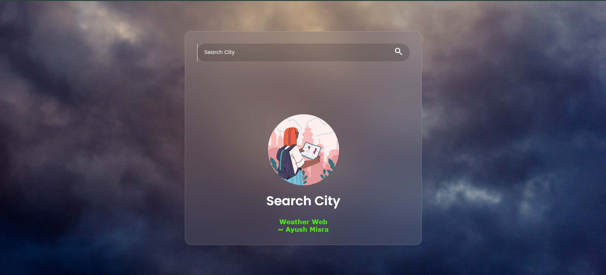
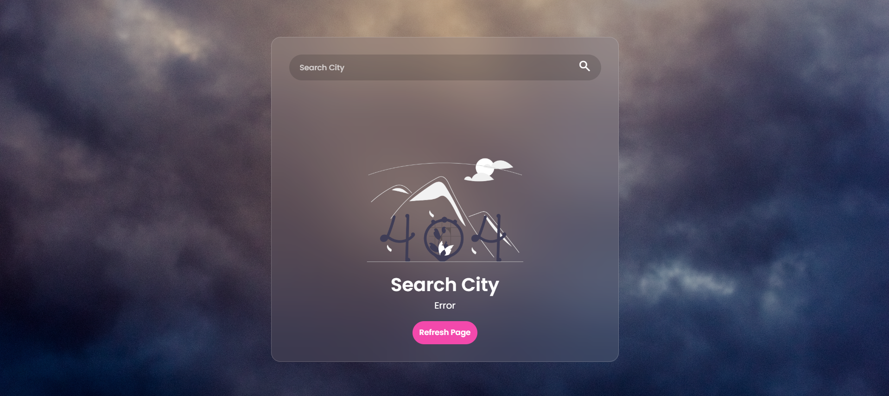
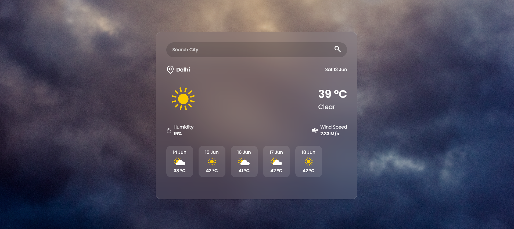

# 🌦️WeatherWeb
A lightweight and responsive weather app built using HTML, CSS, and JavaScript, featuring real-time API integration, smooth animations, and clean UI for an enhanced user experience.
---

## 🚀 Live Demo

🔗 https://weatherwebappapi.netlify.app/
---

## 📸 Screenshots

### 🌤️ Main Interface







### 📱 Responsive Design


---

## ✨ Features

* 🌍 Real-time weather data using API
* 📍 Search weather by city name
* 🌡️ Displays:

  * Temperature
  * Humidity
  * Wind speed
  * Weather conditions
* 🎨 Dynamic UI based on weather (rain, snow, clouds, etc.)[In-Progress]
* 📱 Fully responsive (mobile, tablet, desktop)
* ⚡ Smooth animations and transitions
---

## 🛠️ Tech Stack

* **Frontend:** HTML, CSS, JavaScript
* **API:** OpenWeatherMap (or your API)
* **Design:** Glassmorphism UI + animations

---


## 📁 Project Structure

```
weather-web/
│── index.html
│── style.css
│── script.js
│── /assets
│── /screenshots
```

---

## 🚀 Future Improvements

* 📊 7-day weather forecast
* 📍 Auto-detect user location (Geolocation API)
* 🌐 Multi-language support
* 🔔 Weather alerts & notifications
* 📈 Charts for temperature trends

---

## 📜 License

This project is licensed under the MIT License.

---

## 🙌 Acknowledgements

* OpenWeatherMap API
* Inspiration from modern weather UI designs

---

## 💻 Author

Ayush Misra
🔗 GitHub:https://github.com/AyushMisra360

---

⭐ If you like this project, consider giving it a star!
